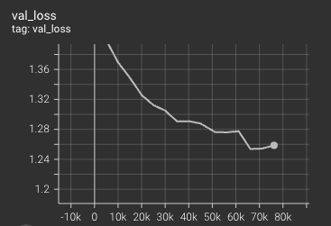

# prot-gpt


This an implementation of nano (femto?) GPT model trainable on protein sequences made of amino acids; inspired from the [original NanoGPT](https://github.com/karpathy/nanoGPT) implementation of Andrej Karpathy. Compared to the original implementations the main changes are:
* This model trains on multiple *independent* sequences. That is, the context only contains the current sequence (and not those appearing before in the training set).
* Since the protein sequences have variable lengths, it does padding and masking. The sequences are padded to the block size (for batching), and the weights corresponding to the padded tokens are then masked out inside the transformer model, in order to avoid communication to/from padded tokens.
* The training loop relies on PyTorch Lightning, which makes our lives a little easier.

The default parameters in `train_proteins.py` will build a ~10M parameters models trainable in a few hours on a GPU with 8 GB of RAM (e.g. 2080).




## Procedure
1. Prepare Python
```
$ pip install -r requirements.txt
```

2. Download sequences from PDB:
```
$ mkdir data && cd data
$ wget https://ftp.wwpdb.org/pub/pdb/derived_data/pdb_seqres.txt.gz
$ gzip -d pdb_seqres.txt.gz && cd ..
```

3. Pre-process sequences:
```
$ python preprocess_pdb_seqres.py
```
That creates a file `data/prot_seqs.txt`, which contains `mol:protein` entries of the PDB file (one entry per distinct name).

4. Choose hyper-parameters in `train_proteins.py` and train model:
```
$ python train_proteins.py
```
You can launch a Tensorboard instance to watch the model being trained.

At the end (or if CTRL+C'ing) the path to the best model checkpoint should be displayed.

5. Generate 100 proteins using a checkpointed model:
```
$ python generate_proteins.py 100 path/to/checkpoint.ckpt
```
This writes the generated proteins in a file `generated_proteins.txt`.

6. Visualise with AlphaFold:
Use the [AlphaFold Colab](https://colab.research.google.com/github/deepmind/alphafold/blob/main/notebooks/AlphaFold.ipynb) with your own sequences!